# Credit Card Fraud Detection — XGBoost, cost-based decisions and SHAP


A fraud model is only useful if it turns scores into good **decisions**. This project trains an XGBoost
classifier on the ULB credit card dataset and then asks the question a fraud team actually cares about:
*which transactions should an analyst review, and how much money does that save?*

**Headline results (chronological hold-out test set: the last 20% of transactions, 56,746 rows, 74 frauds)**

| | |
|---|---|
| XGBoost PR-AUC | **0.798** (95% bootstrap CI 0.715–0.877) vs 0.745 for logistic regression |
| Best decision policy | **expected-cost rule** (flag if P(fraud) × amount ≥ €5 review cost) |
| Fraud loss avoided | **71.6%** with 78 alerts, vs 61.1% at the default 0.5 threshold |
| Naive "catch 90% of fraud" target | 4,958 alerts, **costs 3.4× more than having no model** |
| Calibration | Brier score 0.00054 → 0.00040 after Platt scaling |
| Explainability | SHAP TreeExplainer: global drivers V4, V14, V12; per-transaction waterfalls for a caught and a missed fraud |

---

## 1. Data

[ULB / Worldline credit card fraud dataset](https://www.kaggle.com/datasets/mlg-ulb/creditcardfraud):
284,807 European card transactions over 48 hours (September 2013), 492 frauds (0.173%).
`V1`–`V28` are PCA components released for confidentiality; only `Time` (seconds since the first
transaction) and `Amount` (EUR) are in original units.

- **1,081 exact duplicate rows removed** (including 19 frauds), leaving 283,726 rows and 473 frauds.
  Duplicates could otherwise sit in both train and test.
- Fraud amounts are *smaller* on median than legitimate ones (€9.82 vs €22.00), with a spike at €0–1
  consistent with card-testing charges.

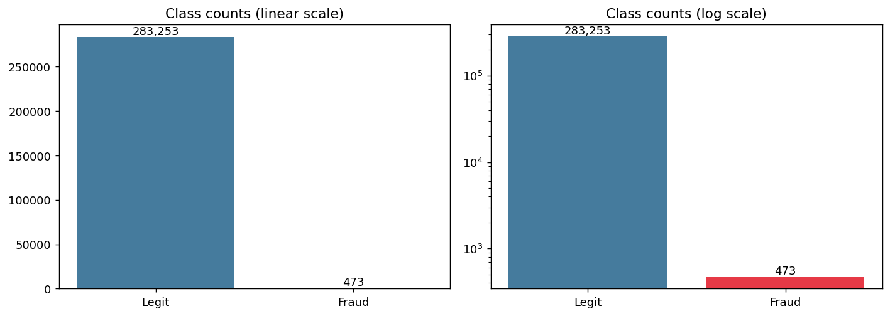
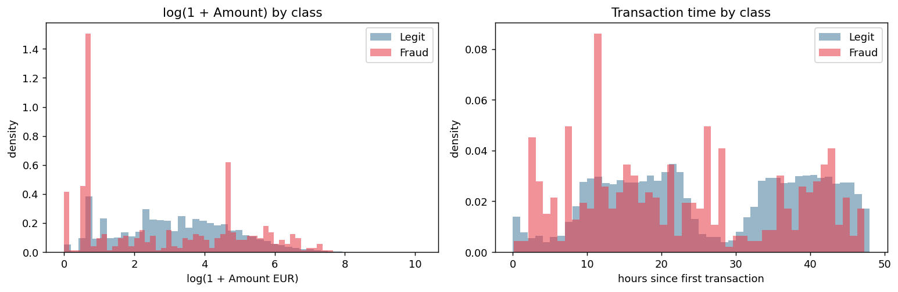

## 2. Method

### Chronological split

Transactions are sorted by `Time` and split 60 / 20 / 20. The model is always evaluated on
transactions that happen after everything it learned from.

| split | rows | frauds | fraud rate | hours |
|---|---|---|---|---|
| train | 170,235 | 342 | 0.201% | 0.0 – 33.4 |
| validation | 56,745 | 57 | 0.100% | 33.4 – 40.3 |
| test | 56,746 | 74 | 0.130% | 40.3 – 48.0 |

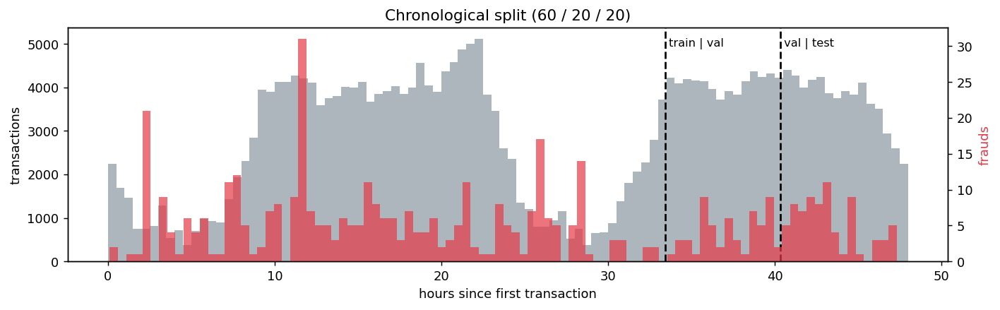

**Everything tuned is chosen on validation**: XGBoost hyperparameters, the Platt calibrator and every
threshold. The test block is scored once.

### Features

`V1`–`V28` as given, `log_amount = log(1 + Amount)`, and `hour_sin` / `hour_cos` (time of day on a circle).
Raw `Time` is dropped because it only encodes "day 1 vs day 2". Features are stateless and the
logistic-regression scaler sits inside a `Pipeline`, so no test statistics leak into training.

### Models

| model | imbalance handling |
|---|---|
| Logistic regression (+ StandardScaler) | `class_weight="balanced"` |
| Random forest, 300 trees | `class_weight="balanced_subsample"` |
| XGBoost, 400 trees, lr 0.05 | `scale_pos_weight` = 496.8 (legit / fraud in train) |

XGBoost `max_depth` × `min_child_weight` was grid-searched on validation PR-AUC
(best: depth 5, min_child_weight 5 → 0.787; full grid in `results/xgb_grid_search.csv`).

## 3. Results

### Ranking quality

| model | val PR-AUC | test PR-AUC | 95% CI | test ROC-AUC | precision@100 |
|---|---|---|---|---|---|
| Logistic regression | 0.753 | 0.745 | 0.638 – 0.852 | **0.981** | 0.59 |
| Random forest | 0.765 | **0.809** | 0.732 – 0.889 | 0.965 | 0.59 |
| **XGBoost (selected)** | **0.787** | 0.798 | 0.715 – 0.877 | 0.970 | 0.60 |

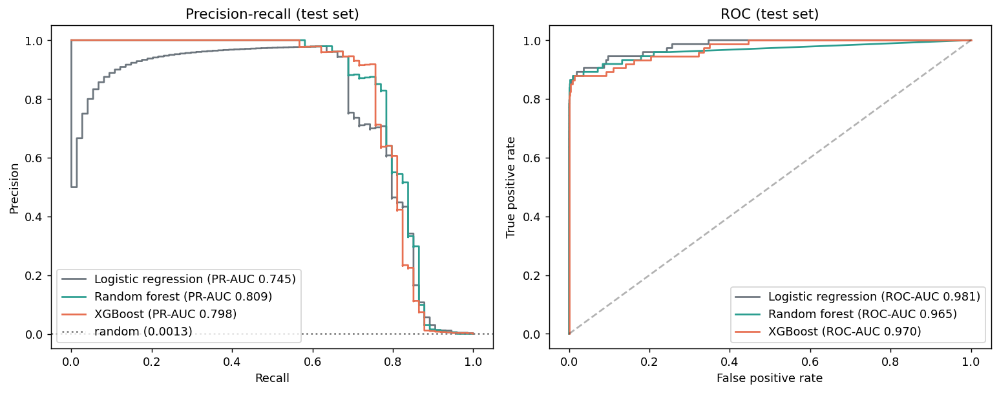

- **Why PR-AUC:** logistic regression has the *best* ROC-AUC but the *worst* PR-AUC. At the default
  threshold it catches 90.5% of frauds but raises 2,872 false alarms (2.3% precision). ROC's
  false-positive *rate* divides those by ~56,700 legitimate transactions and hides them; precision does not.
  PR-AUC's random baseline is the fraud rate (0.0013), not 0.5.
- **XGBoost vs random forest:** XGBoost was chosen because it led on validation. Random forest is 0.011
  higher on test, but the paired bootstrap difference is −0.012 (95% CI −0.040 to +0.014), so they are
  statistically tied. Switching models after seeing the test score would be test-set leakage.
- **XGBoost vs logistic regression:** +0.045 PR-AUC, CI −0.014 to +0.130. With 74 test frauds the gain is
  likely but not certain.
- **Random vs chronological split:** a random stratified split gives PR-AUC 0.817 vs 0.798, only 1.9 points
  more optimistic here (well inside the CI). The time split is used because it matches deployment.

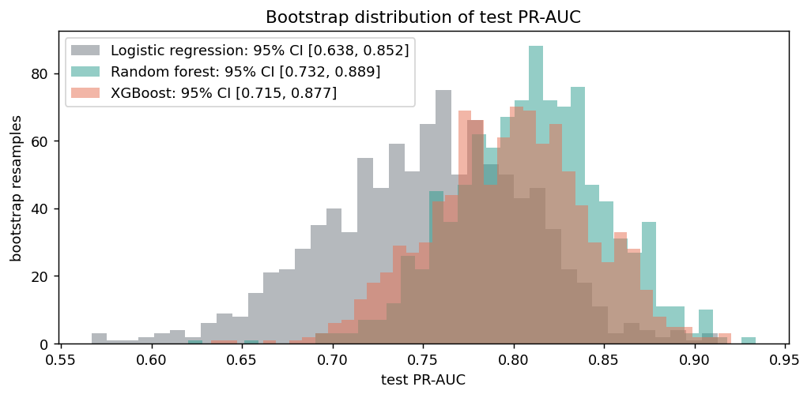

### Calibration

`scale_pos_weight` inflates scores: a raw score of 0.5 corresponds to a calibrated fraud probability of
only 0.082. Platt scaling (fit on validation) lowers the Brier score from 0.00054 to 0.00040 and brings
the mean predicted probability (0.0012) close to the true test fraud rate (0.0013). PR-AUC is unchanged
because the mapping is monotonic.

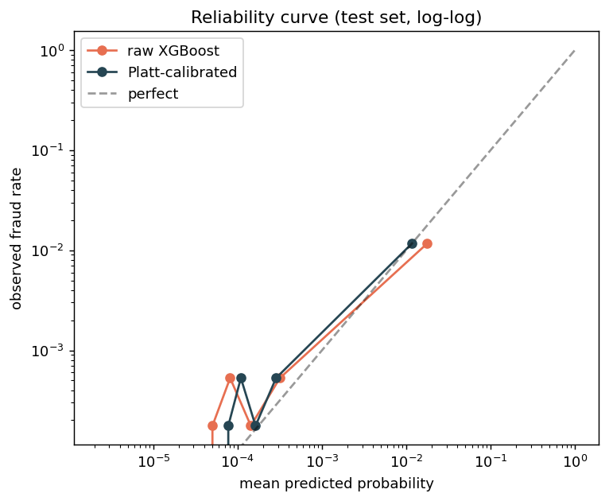

### Decisions: five policies, measured in euros

**Cost model (assumption):** each alert costs €5 of analyst time; each missed fraud costs its amount.
*Saving* = share of the no-model loss (€7,727.67 of fraud in test) avoided after paying for reviews.

| policy (all fixed on validation) | alerts | frauds caught | recall | precision | fraud € caught | saving |
|---|---|---|---|---|---|---|
| Default 0.5 (raw score) | 74 | 56 / 74 | 75.7% | 75.7% | 65.9% | 61.1% |
| 90% recall target | 4,958 | 65 / 74 | 87.8% | 1.3% | 77.8% | **−243.0%** |
| Single cost-optimal threshold | 55 | 52 / 74 | 70.3% | 94.5% | 52.4% | 48.9% |
| **Expected-cost rule**: P × Amount ≥ €5 | 78 | 25 / 74 | 33.8% | 32.1% | **76.6%** | **71.6%** |
| **Expected-cost + guardrail** (or P ≥ 0.5) | 115 | 57 / 74 | **77.0%** | 49.6% | 77.1% | 69.7% |

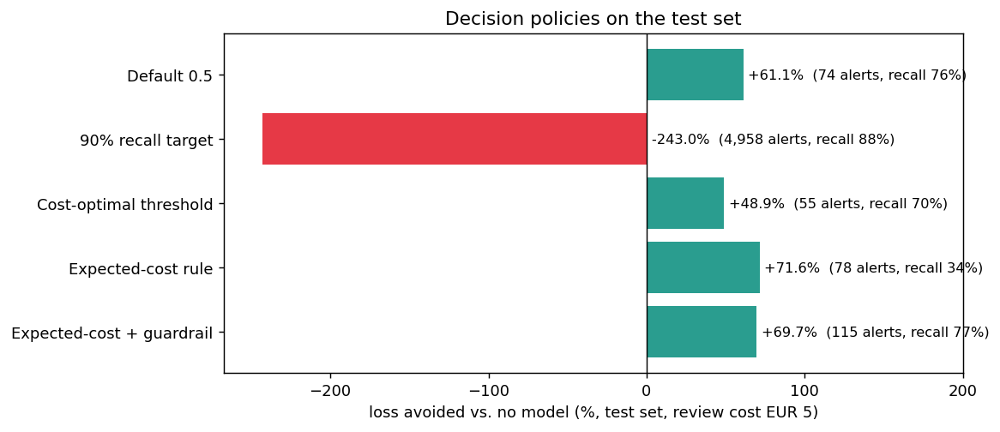
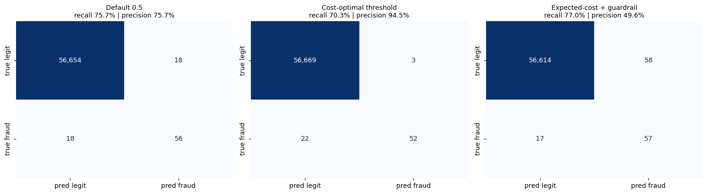

What this shows:

1. **A recall target is not a business objective.** Reaching 90% recall on validation required a threshold
   of 0.00046, which flags 1 in 11 test transactions. Total cost (€26,506, mostly €24,790 of reviews) is
   3.4× the €7,728 lost with no model at all.
2. **A single "cost-optimal" threshold overfits.** It was the best policy on validation (61.7% saving) and
   the worst positive policy on test (48.9%). With 57 validation frauds the cost curve is almost flat between
   0.01 and 0.7 (below), so where exactly its minimum falls is largely chance.
3. **The expected-cost rule generalises best.** It has no tuned threshold, only calibrated probabilities, and
   spends reviews where the money is: it catches a third of fraud *cases* but 77% of fraud *euros*.
   42 of the 49 frauds it skips are under €10 (median €1).
4. **The guardrail** adds "always flag if P ≥ 0.5", so small, very likely frauds (possible card testing) are not
   ignored. Case recall rises to 77% for 1.9 points less saving and 37 more alerts.

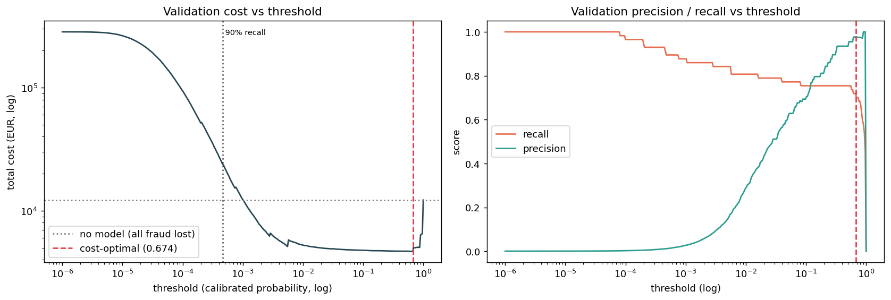

**Sensitivity to the €5 assumption** (`results/cost_sensitivity.csv`):

| review cost | single threshold: saving | expected-cost: saving (alerts) | guardrail: saving (alerts) |
|---|---|---|---|
| €1 | 70.0% | 72.7% (327) | 72.5% (355) |
| €2 | 70.2% | 72.5% (170) | 71.9% (203) |
| €5 | 48.9% | 71.6% (78) | 69.7% (115) |
| €10 | 45.3% | 62.5% (44) | 58.2% (83) |
| €20 | 38.2% | 57.2% (28) | 47.7% (68) |

The expected-cost rule beats the single threshold at every cost level, and its alert count adjusts
automatically.

### Explainability (SHAP)

SHAP values split each raw XGBoost output (log-odds) into additive per-feature contributions;
TreeExplainer computes them exactly for tree models. Global importance = mean |SHAP| on 2,000 test rows:

| rank | feature | mean \|SHAP\| |
|---|---|---|
| 1 | V4 | 1.85 |
| 2 | V14 | 1.74 |
| 3 | V12 | 1.22 |
| 4 | V11 | 0.80 |
| 5 | V10 | 0.74 |
| 8 | log_amount | 0.43 |

Low values of V14, V12 and V10 and high values of V4 and V11 push toward fraud. The hour features are not
in the top 15, so the model does not rely on time of day.

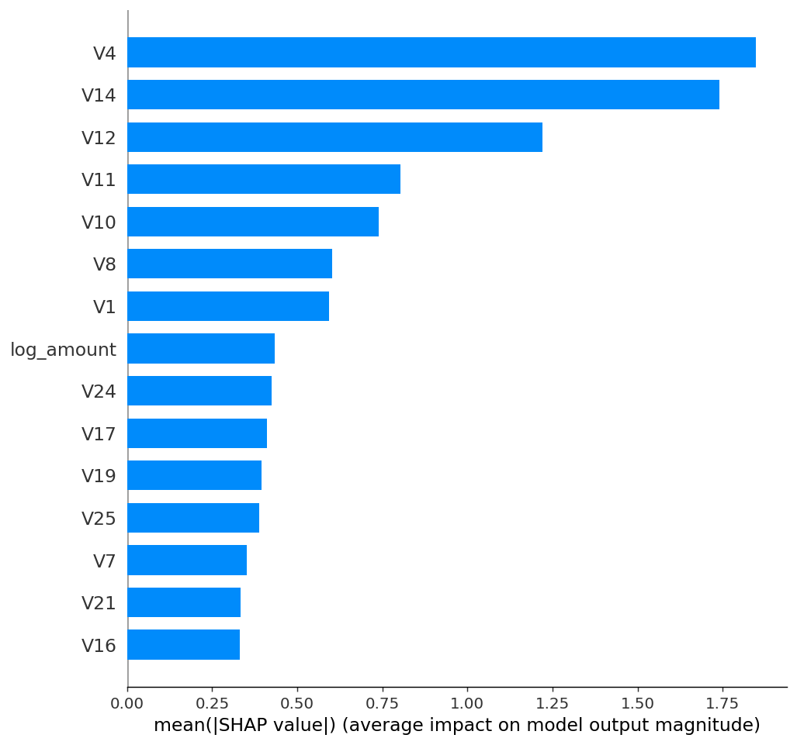
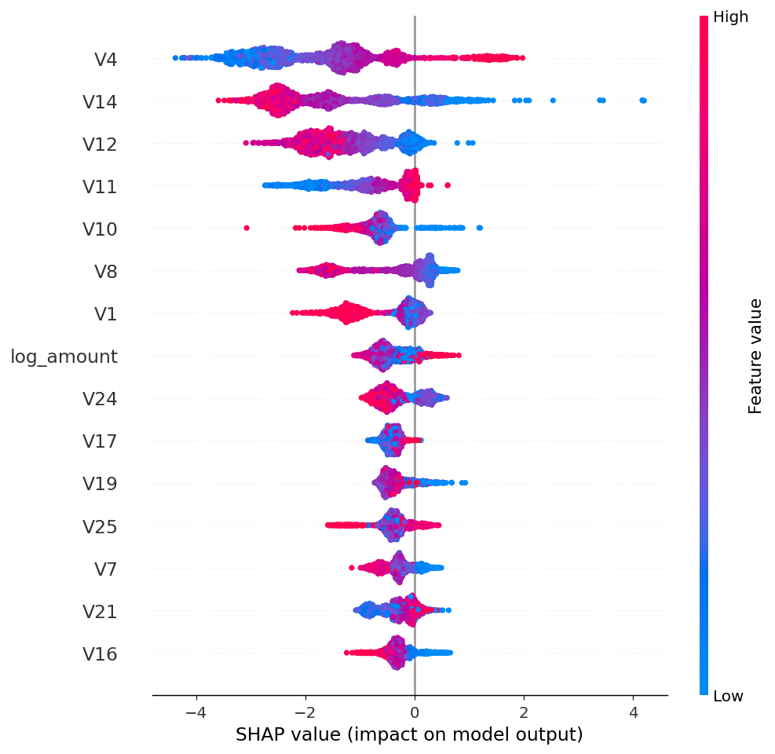

**Per-transaction explanations.**

- *Highest-scored test fraud* (calibrated P = 0.996): V14 = −4.29 adds **+3.97** log-odds (odds × ~53),
  then V10 = −4.53 (+1.30) and V4 = 3.04 (+1.13).
- *Lowest-scored test fraud* (P = 0.00008): V11 (−2.26), V14 = 0.98 (−2.19) and V8 (−1.78) all look
  legitimate. This fraud cannot be caught with these features without flagging thousands of normal transactions.

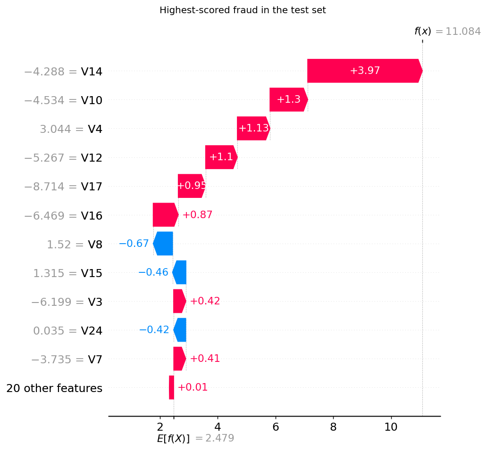
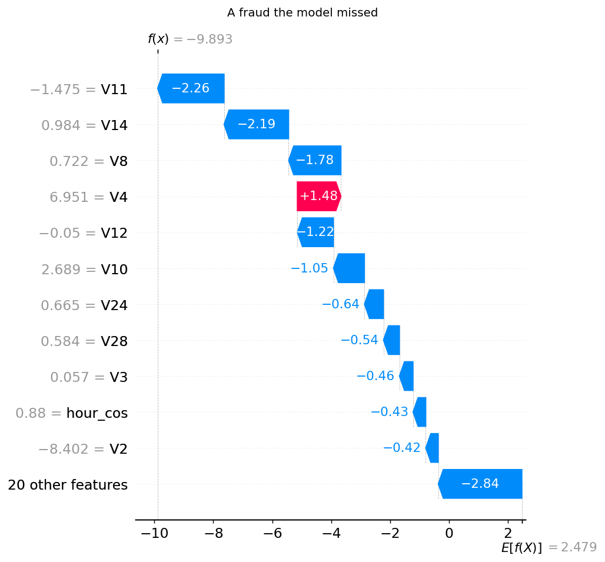

## 4. Limitations

1. **Few positives:** 57 validation and 74 test frauds. Test PR-AUC is uncertain by about ±0.08.
2. **48 hours of data:** the time split only approximates the drift a production model faces over months.
3. **Simplified costs:** real costs add chargeback fees, customer friction from false declines and analyst
   capacity limits. The €5 review cost is an assumption, hence the sensitivity table.
4. **Anonymised features:** SHAP can rank `V14` but cannot say what it means in business terms.
5. **Validation reused three times** (hyperparameters, calibration, policy thresholds); a larger dataset
   would use separate blocks.
6. **No card or customer ID**, so velocity features (e.g. transactions per card per hour), usually the
   strongest real-world signals, cannot be built.

## 5. Repository layout

```
├── data/README.md                 # where to put creditcard.csv (not committed)
├── notebooks/
│   └── credit_card_fraud_detection.ipynb   # full walkthrough, executed, plots embedded
├── src/fraud/
│   ├── config.py      # paths, seed, split fractions, cost assumptions, XGBoost grid
│   ├── data.py        # load + validate, de-duplicate, chronological / random split
│   ├── features.py    # log_amount, cyclical hour
│   ├── models.py      # LogReg / RF / XGBoost factories, Platt calibrator
│   ├── threshold.py   # cost accounting, thresholds, expected-cost rule
│   ├── evaluate.py    # PR-AUC, ROC-AUC, Brier, precision@k, bootstrap CIs
│   ├── plots.py       # every figure
│   └── pipeline.py    # the steps, and run_all()
├── scripts/run_pipeline.py        # one command: figures/ + results/ + models/
├── tests/                         # 14 pytest tests (no dataset needed)
├── figures/                       # all plots used above
├── results/                       # metrics.json and CSV tables behind every number here
├── models/xgb_model.json          # trained XGBoost model
└── requirements.txt               # exact versions used
```

## 6. Reproduce

```bash
pip install -r requirements.txt
# put creditcard.csv in data/ (see data/README.md)
python -m pytest -q                 # 14 tests, no data needed
python scripts/run_pipeline.py      # ~3 minutes on a laptop CPU
```

Results were produced with Python 3.11 and the exact versions in `requirements.txt`; other XGBoost versions
can move the third decimal. Seed: 42.

## Reference

Dal Pozzolo, A., Caelen, O., Johnson, R. A., & Bontempi, G. (2015). *Calibrating probability with
undersampling for unbalanced classification.* IEEE Symposium Series on Computational Intelligence.

## License

MIT
